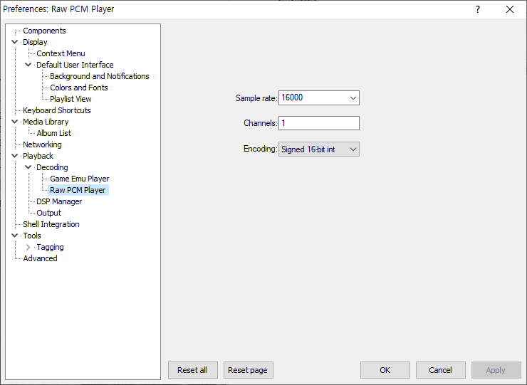

# foo_input_raw

Headless .raw .pcm player component for foobar2000

## Refereshing file info

Because of foobar2000's cache behavior, file infos become incorrect after changing input preference. [(It's hard or impossible to fix.)](https://hydrogenaud.io/index.php?topic=119884.0)

It should be manually reloaded using:
- Select relevant tracks → Shift + Right-click → 'Tagging' → 'Reload info from file(s)'

Or you can assign reload button at toolbar:
- Right-click Buttons tool bar  → 'Customize Buttons...'
- In Available Commands, expand '[context]' → 'Tagging' → 'Reload info from file(s)'
- Hit 'Add'

Then you can just select file(s) and hit the button to update info.
